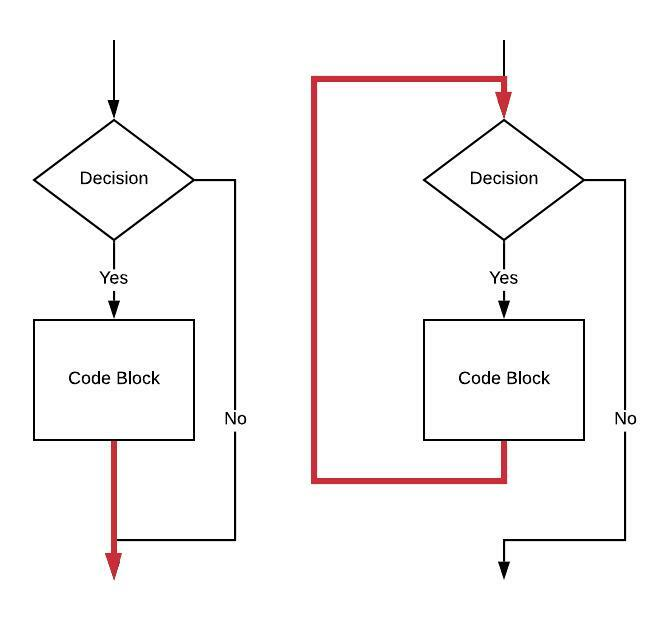

# While Loops

## Overview

We have already [covered](../../if/README.md) the `if` statement. A `while`
loop is exactly the same with the addition of at least one branch and a
label. It really is that simple.

To illustrate this, here is a flow chart of an `if` statement (on the
left) compared to a `while` loop (on the right).



The closing brace in an `if` statement is indicated by the red arrow
head. This isn't a branch, the code flow simply falls through to the
statement beyond the closing brace. In the `while` loop, the behavior of
the closing brace changes to be that of a branch back to just before the
evaluation of the boolean condition (the "Decision").

A new label is placed before evaluating the "Decision".

A new unconditional branch is placed after the end of the "Code Block."

For review, consider this C or C++ code:

```c
if (a >= b) {
    // CODE BLOCK
}
```

here is the assembly language for this `if` statement:

```asm
    // Assume value of a is in x0                                       // 1 
    // Assume value of b is in x1                                       // 2 
    cmp     x0, x1                                                      // 3 
    ble     1f                                                          // 4 
    // CODE BLOCK                                                       // 5 
1:                                                                      // 6 
```

Now, consider this `while` loop:

```c
while (a >= b) {
    // CODE BLOCK
}
```

Here is the code for the `while` showing the addition of one new label
and one new unconditional branch:

```asm
    // Assume value of a is in x0                                       // 1 
    // Assume value of b is in x1                                       // 2 
                                                                        // 3 
 1: cmp     x0, x1                                                      // 4 
    blt     2f                                                          // 5 
    // CODE BLOCK                                                       // 6 
    b       1b                                                          // 7 
                                                                        // 8 
2:                                                                      // 9 
```

Temporary label `2` on `line 9` takes the place of the line after the
closing brace in a `while` loop.

Temporary label `1` on `line 4` is the end point of the red arrow in the
right hand flow chart above.

## Summary

A `while` loop is an extension of the `if` statement. A simple `if`
contains one conditional branch and one label.

A `while` loop contains at least two labels, one conditional branch and
one unconditional branch. We acknowledge the possibility that the
unconditional branch could be made a conditional one, but this is rarely
done in assembly language and impossible in higher level languages like
C and C++ since the branch is simply the closing `}`.

## Questions

### 1

(T | F) This code has a problem:

```asm
    // Assume value of a is in x0                                       // 1 
    // Assume value of b is in x1                                       // 2 
                                                                        // 3 
 1: cmp     x0, x1                                                      // 4 
    b       2f                                                          // 5 
    // CODE BLOCK                                                       // 6 
    b       1b                                                          // 7 
                                                                        // 8 
2:                                                                      // 9 
```

Answer: True - the unconditional branch on `line 5` doesn't reference the
results of the `cmp` that comes before it. The `CODE BLOCK` will never be
executed.

### 2

(T | F) This attempt at a `while` loop has a problem:

```asm
    // Assume value of a is in x0                                       // 1 
    // Assume value of b is in x1                                       // 2 
                                                                        // 3 
 1: cmp     x0, x1                                                      // 4 
    ble     2f                                                          // 5 
    // CODE BLOCK                                                       // 6 
                                                                        // 7 
2:                                                                      // 8 
```

Answer: True - missing a branch back to label `1`, there is no loop.
